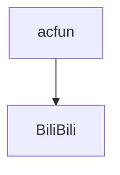
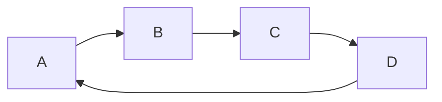
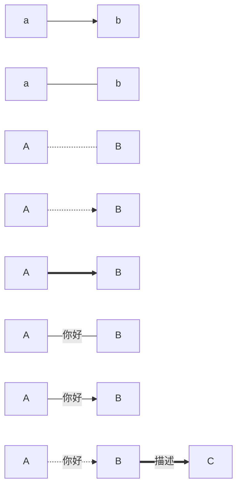
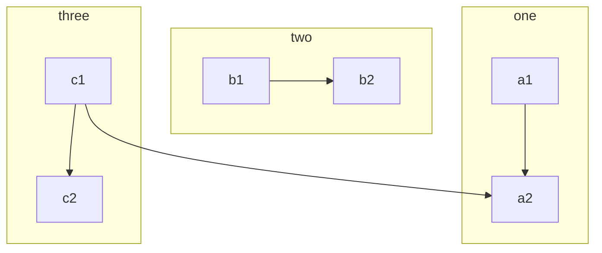
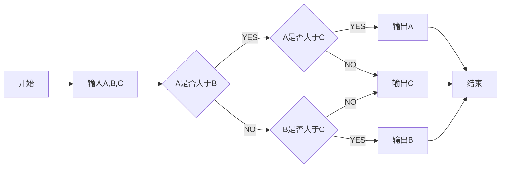

# Markdown语法

## 目录{#index}

```java
// 给文档添加目录, 在需要的位置加入[TOC]即可
[TOC]
```


[TOC]

## 一.代码{#index}

```java
// 代码块语法
​```java
​```shell    
```

### 1. Java

```java
@Data
public class DsWorkflowNode implements Serializable{

    private String id;
    private String nodeName;
    private String nodeIntroduction;
    private String nextNodeId;
    private String nextNodeName;

}
```

### 2. shell

```shell
# sudo docker images
```

## 二.标题

```java
# 一级标题
## 二级标题
### 三级标题
#### 四级标题    
##### 五级标题
###### 六级标题    
```

# 一级标题
## 二级标题
### 三级标题
#### 四级标题    
##### 五级标题
###### 六级标题 


## 三.字体

```java
// 加粗
**等不到天黑**
// 代码高亮显示
==我不是孙红雷==
// 删除线
~~被删除的文字~~
// 斜体
*斜体*
// 加粗斜体
***加粗斜体***    
```

**等不到天黑**
==我不是孙红雷==
~~被删除的文字~~
*斜体*

***加粗斜体***

## 四.引用

```java
// 引用语法
>作者: youxiue
>>作者: youxiue
>>>作者: youxiue
```

>作者: youxiue
>>作者: youxiue
>>
>>>作者: youxiue

## 五.分割线

```java
// 分割线
---
// 分割线2
***    
```

---


***


## 六.图片插入

```java
// 在线图片/本地图片
 --图片路径
// 参考式
![图2][flower]
```


![图二][flower]

[flower]:E:\360downloads\325607.jpg	"图二"


## 七.超链接

```java
// 1. 行内式链接
这是一个[百度](https://www.baidu.com)链接
// 2. 参考式链接
我经常去的几个网站[百度][1],[哔哩哔哩][2]以及[CSDN][]  
// 3. 自动链接         
<http://www.baidu.com>
<youxiue@qq.com>         
```

### 行内式链接

这是一个[百度](https://www.baidu.com)链接

### 参考式链接

我经常去的几个网站[百度][1],[哔哩哔哩][2]以及[微博][]

[1]:http://www.baidu.com	"百度"
[2]:http://www.bilibili.com	"哔哩哔哩"
[CSDN]:https://www.csdn.net

1. ### 自动链接

   <http://www.baidu.com>

   <youxiue@qq.com>

## 八.列表语法

```java
// 无序列表
- 目录1
- 目录2
- 目录3   
// 有序列表 1+.+空格+名称 
1. 首页
2. 分类    
```

- 目录1
- 目录2
- 目录3    

1. 首页
2. 分类


## 九.表格

| 姓名 | 语文 | 数学 |
| :--: | :--: | :--: |
| jojo |  99  |  99  |
| dio  | 100  | 100  |
| lisa |  45  |  34  |


## 十.锚点{#a}

```java
//在你准备跳转到的指定标题后插入锚点{#标记}，然后在文档的其它地方写上连接到锚点的链接。
// 1. 添加锚点
 	目录{#index}
// 2. 添加跳转锚点
	跳转到[目录](#index)
```

跳转到[目录](#index)

跳转到[锚点](#a)


## 十一.标记

```java
//起标记作用
快捷键`ctrl+a`
```

快捷键`ctrl+a`


## 十二.注脚

```java
//在需要添加注脚的文字后加上脚注名字[^注脚名字],称为加注。 然后在文本的任意位置(一般在最后)添加脚注，脚注前必须有对应的脚注名字。

//注意：经测试注脚与注脚之间必须空一行，不然会失效。成功后会发现，即使你没有把注脚写在文末，经Markdown转换后，也会自动归类到文章的最后。

		春江花月夜[^1]
江天一色无纤尘,皎皎空中孤月轮.
江畔何人初见月,江月何年初照人.
人生代代无穷已,江月年年望相似[^2].
不知江月待何人,但见长江送流水. 
            
[^1]:唐朝张若虚,一首诗压盛唐
[^2]:有一说是: 江月年年只相似            
```


​				春江花月夜[^1]

江天一色无纤尘,皎皎空中孤月轮.
江畔何人初见月,江月何年初照人.
人生代代无穷已,江月年年望相似[^2].
不知江月待何人,但见长江送流水. 
            

[^1]:唐朝张若虚,一首诗压盛唐
[^2]:又一说是: 江月年年只相似  


## 十三. LaTeX公式

```java
// 1. $ 表示行内公式
质量守恒方程可以用一个很简洁的方程式 $E=mc^2$ 来表达
// 2. $$ 表示整行公式
$$sum_{i=1}^n a_i=0$$
```

#### 行内公式

​	质量守恒方程可以用一个很简洁的方程式 $E=mc^2$ 来表达

#### 整行公式

​	$$sum_{i=1}^n a_i=0$$


## 十四.流程图

```java
//用mermaid了，mermaid支持三种图形的绘制, 分别是流程图, 时序图和甘特图

​```mermaid
    graph 流程图方向
    流程图内容
​```
// 节点语法 ID[文本内容], ID 是这个节点的标识,文本内容是该节点的显示内容
// 通过ID来建立节点之间的联系
	A[A] --> B[B]
    
```

#### 1. 流程图方向

> 流程图方向有下面几个值
>
> - TB从上到下
> - BT从下到上
> - RL从右到左
> - LR从左到右
> - TD同TB


##### 1.1 从上到下



##### 1.2 从左到右



#### 2. 基本图形

* id + [文字描述]矩形
* id + (文字描述)圆角矩形
* id + >文字描述]不对称的矩形
* id + {文字描述}菱形
* id + ((文字描述))圆形


#### 3.节点之间的连接

- A --> B	 A带箭头指向B
- A --- B      A不带箭头指向B
- A -.- B      A用虚线指向B
- A -.-> B    A用带箭头的虚线指向B
- A ==> B   A用加粗的箭头指向B
- A -- 描述 --- B       A不带箭头指向B并在中间加上文字描述
- A -- 描述 --> B      A带箭头指向B并在中间加上文字描述
- A -. 描述 .-> B       A用带箭头的虚线指向B并在中间加上文字描述
- A == 描述 ==> B   A用加粗的箭头指向B并在中间加上文字描述



#### 4.子流程图

```java
// 子流程图的语法
subgraph title
    graph definition
end
```



#### 5.自定义样式


#### demo.判断出ABC中最大的一个数



