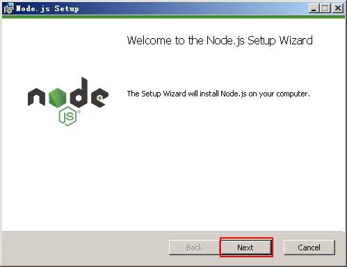
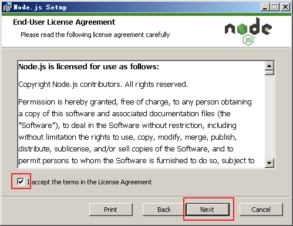
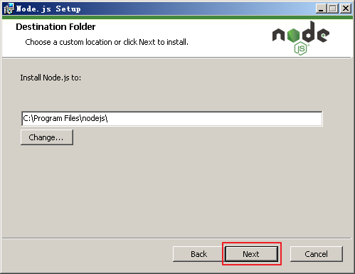
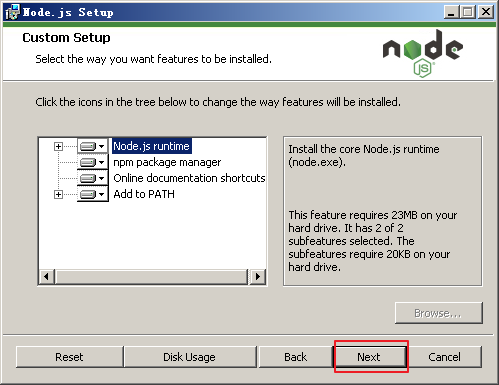
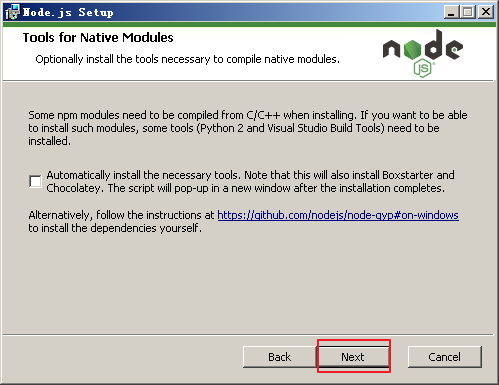
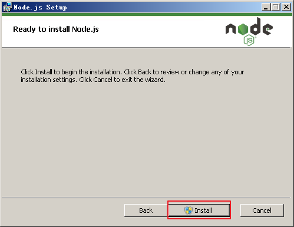
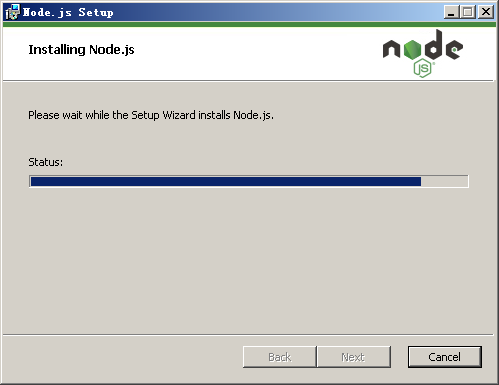
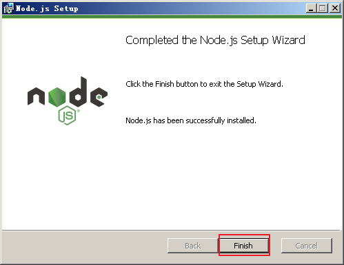
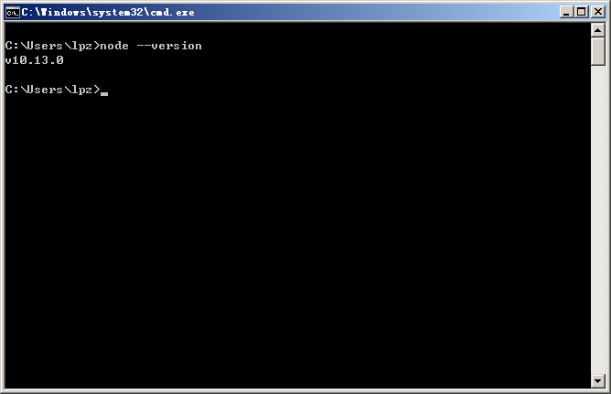

# 第3章 起步

[TOC]

---

## 安装 Node 环境

### 版本说明

- LTS 长期支持版，适用于开发和生产环境
- Current 最新版，适用于体验测试

### 下载

- https://nodejs.org/en/download/

### 安装（Windows）



点击下一步



同意协议，点击下一步



点击下一步



点击下一步



点击下一步



点击 Install 开始安装



正在安装中...



安装完成，点击 Finish 结束。


### 确认是否安装成功

打开命令行，输入 `node --version` 或者 `node -v`。如果能看到类似于下面输出 `v10.13.0` 的版本号，则表示安装成功。



> 注意：如果是安装之前打开的命令行请在安装结束之后关闭重新打开再执行上述命令

## REPL

> 类似于浏览器中的 Console ，可以做一些基本的代码测试。
>
> - R：Read 读取
> - E：Eval 执行
> - P：Print 输出
> - L：Loop 循环

- 进入
  - 输入 `node` 回车即可
- 使用
- 离开
  - 按住 `Ctrl` 不要丢，`c` 两次即可退出


---

## 执行一个JS文件

**1. 新建一个 hello.js 并写入以下示例代码**

```javascript
const message = 'Hello Node.js!'
console.log(message)

```

**2. 打开命令行并定位到 `hello.js` 文件所属目录**

**3. 在命令行中输入 `node hello.js` 回车执行**

> 注意：
> - 文件名不要起名为 `node.js`
> - 文件名或者文件路径最好不要有中文
> - 文件路径或者文件名不要出现空格

---

## 文件读写

文件读取：

```javascript
const fs = require('fs')

fs.readFile('/etc/passwd', (err, data) => {
  if (err) throw err
  console.log(data)
})

```

文件写入：

```javascript
const fs = require('fs')

fs.writeFile('message.txt', 'Hello Node.js', (err) => {
  if (err) throw err
  console.log('The file has been saved!')
})

```

---

## HTTP 服务

```javascript
// 接下来，我们要干一件使用 Node 很有成就感的一件事儿
// 你可以使用 Node 非常轻松的构建一个 Web 服务器
// 在 Node 中专门提供了一个核心模块：http
// http 这个模块的职责就是帮你创建编写服务器的

// 1. 加载 http 核心模块
var http = require('http')

// 2. 使用 http.createServer() 方法创建一个 Web 服务器
//    返回一个 Server 实例
var server = http.createServer()

// 3. 服务器要干嘛？
//    提供服务：对 数据的服务
//    发请求
//    接收请求
//    处理请求
//    给个反馈（发送响应）
//    注册 request 请求事件
//    当客户端请求过来，就会自动触发服务器的 request 请求事件，然后执行第二个参数：回调处理函数
server.on('request', function () {
  res.end('Hello Node.js!')
})

// 4. 绑定端口号，启动服务器
server.listen(3000, function () {
  console.log('服务器启动成功，请求访问 http://127.0.0.1:3000/')
})
```

## Node.js 中的 JavaScript

### ECMAScript

### 全局成员

> [Global Objects](https://nodejs.org/dist/latest-v10.x/docs/api/globals.html)

### 模块化

## 小结