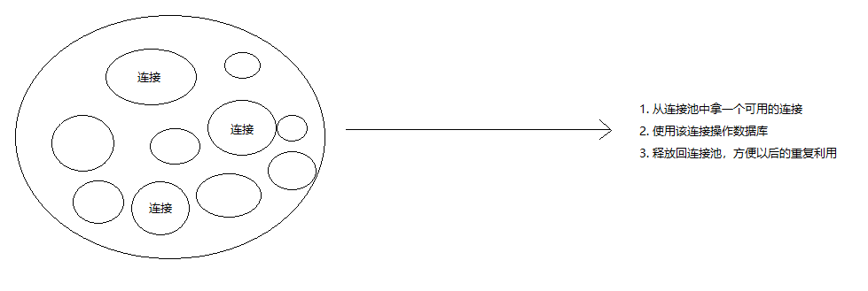

# 第10章 使用数据库存储网站数据

**学习目标**

- 使用 mysql 包操作 MySQL 数据库
- 使用数据库的动态网站
- 基于数据库的网站（增删改查）


## 使用 mysql 包

### 安装

```shell
npm install mysql
```

### Hello World

```javascript
var mysql      = require('mysql');
var connection = mysql.createConnection({
  host     : 'localhost',
  user     : 'me',
  password : 'secret',
  database : 'my_db'
});

connection.connect();

connection.query('SELECT 1 + 1 AS solution', function (error, results, fields) {
  if (error) throw error;
  console.log('The solution is: ', results[0].solution);
});

connection.end();
```

---

### 增删改查

#### 查询

基本查询：

```javascript
connection.query('SELECT * FROM `books` WHERE `author` = "David"', function (error, results, fields) {
  // error will be an Error if one occurred during the query
  // results will contain the results of the query
  // fields will contain information about the returned results fields (if any)
});
```

条件查询：

```javascript
connection.query('SELECT * FROM `books` WHERE `author` = ?', ['David'], function (error, results, fields) {
  // error will be an Error if one occurred during the query
  // results will contain the results of the query
  // fields will contain information about the returned results fields (if any)
});
```

#### 添加

```javascript
var post  = {id: 1, title: 'Hello MySQL'};
var query = connection.query('INSERT INTO posts SET ?', post, function (error, results, fields) {
  if (error) throw error;
  // Neat!
});
console.log(query.sql); // INSERT INTO posts SET `id` = 1, `title` = 'Hello MySQL'
```

#### 删除

```javascript
connection.query('DELETE FROM posts WHERE title = "wrong"', function (error, results, fields) {
  if (error) throw error;
  console.log('deleted ' + results.affectedRows + ' rows');
})
```

#### 修改

```javascript
connection.query('UPDATE users SET foo = ?, bar = ?, baz = ? WHERE id = ?', ['a', 'b', 'c', userId], function (error, results, fields) {
  if (error) throw error;
  // ...
})
```

---

### 连接池



```javascript
var mysql = require('mysql');
var pool  = mysql.createPool({
  host     : 'example.org',
  user     : 'bob',
  password : 'secret',
  database : 'my_db',
  connectionLimit: 10 // 默认是 10 个
});

pool.getConnection(function(err, connection) {
  // Use the connection
  connection.query('SELECT something FROM sometable', function (error, results, fields) {
    // 释放回连接池
    connection.release();

    // 处理错误
    if (error) throw error;

    // ...
  });
});
```

### 封装 dbHelper.js

```javascript
const mysql = require('mysql')

const pool = mysql.createPool({
  host: 'localhost',
  user: 'root',
  password: '123456',
  database: 'test',
  connectionLimit: 10 // 默认是 10 个
})

exports.query = (...args) => {
  // 从数组中弹出最后一个元素 callback 回调函数
  const callback = args.pop()

  pool.getConnection((err, connection) => {
    if (err) {
      return callback(err)
    }

    connection.query(...args, function (...results) { // ...results => [err, results, fields]
      // 释放回连接池
      connection.release()
      // 把 ...results => [err, results, fields] 展开调用 callback 继续往外抛
      callback(...results)
    })
  })
}

```

## 结合数据库的网站

