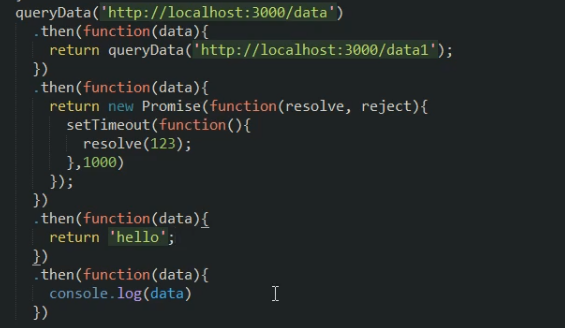

# Promise

## 1. 概述

Promise是异步编程的一种解决方案，从语法上讲，Promise是一个对象， 从它可以获取异步操作的消息。

使用Promise 可以有以下好处：

1. 可以避免多层异步调用嵌套问题（回调地狱）
2. Promise对象提供了简洁的API，是的控制异步操作更加容易。

## 2. 用法

### 2.1基本用法

1. 实例化Promise对象，构造函数中传递函数，该函数中用于处理异步任务。
2. resolve和reject两个参数用于处理成功和失败两种情况，并通过`p.then`获取处理结果

```javascript
var p = new Promise(function(resolve,reject)){
    // 成功时调用resolve()
    // 失败时调用reject()
};
p.then(function(ret)){
    // 从resolve得到正常结果
},function(ret){
    // 从ret得到错误结果
}
```

### 2.2then参数中的函数返回值

1. 返回Promise 实例对象

   返回的该实例对象会调用下一个then

2. 返回普通值

   返回的普通值会传递给下一个then,通过then参数中的函数的参数接受该值.



### 2.3Promise常用的API

1. 实例方法
   - p.then() 得到异步任务的正确结果
   - p.catch() 获取异常信息
   - p.finally() 成功与否都会执行.

```javascript
queryData()
	.then(function(data){
    	console.log(data);
    })
    .catch(function(data){
        console.log(data);
    })
    .finallY(function(){
        console.log('finished');
    })
```

2. 对象方法
   - Promise.all() 并发处理多个异步任务, 所有任务都执行完成才能得到结果
   - Promise.race() 并发处理多个异步任务, 只要有一个任务完成就能得到结果

```javascript
//所有任务都执行完成才能得到结果
Promsise.all([p1,p2,p3]).then((result)=>{
    console.log(result)
})
//只要有一个任务完成就能得到结果
Promsise.race([p1,p2,p3]).then((result)=>{
    console.log(result)
})
```

## 3. 接口调用-fetch用法

### 3.1 fetch概述

1. 基本特性
   - 更加简单的数据获取方式, 功能更加强大, 更灵活, 可以看做是xhr 的升级版
   - 基于Promise实现

2. 语法结构

   ```javascript
   fetch(url)
       .then(fn2)
   	.then(fn3)
   	...
       .catch(fn)
   ```

   

### 3.2 fetch的基本用法

```javascript
fetch('/abc').then(data=>{
    // text()方法属于fetchAPI的一部分,他返回一个Promise实例对象, 用于获取后台返回的数据.
    return data.text();
}).then(ret=>{
    //注意这里得到的才是最终的结果
    console.log(ret);
})
```

### 3.3 fetch请求参数

1. 常用配置选项
   - method(String):HTTP请求方法,默认为GET(GET, POST, PUT, DELETE)
   - body(String): HTTP的请求参数
   - headers(Object):HTTP的请求头, 默认为{ }

```java
//1. get或delete请求方式的参数传递
fetch('/abc/'+参数,{
    method: 'get' // 或delete, get请求这一部分可以不写,因为默认就是get
}).then(data=>{
    return data.text();
}).then(ret=>{
    console.log(ret);
})
//2. post请求方式的参数传递
fetch('/abc/',{
    method: 'post',
    body: 'param1=a$param2=b',
    headers:{
        'Content-Type':'application/x-www-form-urlencoded'
    }
}).then(data=>{
    return data.text();
}).then(ret=>{
    console.log(ret);
})  
// post 请求json格式
fetch('/abc/',{
    method: 'post',
    body: JSON.stringify({
        param1: 'a',
        param2: 'b'
    }),
    headers:{
        'Content-Type':'application/json'
    }
}).then(data=>{
    return data.text();
}).then(ret=>{
    console.log(ret);
})     
```

### 3.4 fetch相应结果

响应数据格式

- text(): 将返回体处理成字符串类型
- json(): 以json 形式接收返回结果

```javascript
fetch('/abc').then(data=>{
    // return data.json();
    return data.text();
}).then(ret=>{
    console.log(ret);
})
```

## 4.接口调用-axios用法

### 4.1 axios的基本特性

[axios](http://www.axios-js.com/)([中文网站](https://www.kancloud.cn/yunye/axios/234845))是一个基于Promise用于浏览器的node.js的Http客户端.

它具有以下特征:

- 支持浏览器和node.js
- 支持Promise
- 能拦截请求和响应
- 自动转换JSON数据

### 4.2 axios的基本用法

```javascript
axios.get('/abc')
	.then(ret=>{
    // data属性名称是固定的, 用于获取后台响应的数据.
    console.log(ret.data);
})
```

1. 执行get 请求

```javascript
// 为给定 ID 的 user 创建请求
axios.get('/user?ID=12345')
  .then(function (response) {
    console.log(response);
  })
  .catch(function (error) {
    console.log(error);
  });

// 可选地，上面的请求可以这样做
axios.get('/user', {
    params: {
      ID: 12345
    }
  })
  .then(function (response) {
    console.log(response);
  })
  .catch(function (error) {
    console.log(error);
  });

```

2. 执行post请求

```javascript
// 默认json 格式数据
axios.post('/user', {
    firstName: 'Fred',
    lastName: 'Flintstone'
  })
  .then(function (response) {
    console.log(response);
  })
  .catch(function (error) {
    console.log(error);
  });
// 表单格式数据
const params = new URLSearchParams();
params.append('param1','value1');
params.append('param2','value2');
axios.post('/api/test',params).then(ret=>{
    console.log(ret.data);
})
```

### 4.3 axios的响应结果

响应结果的主要属性

- data: 实际响应回来的数据
- headers: 响应头信息
- status: 响应状态码
- statusText: 响应状态信息
- config: 为请求提供的配置信息

```javascript
axios.get('/user/12345')
  .then(function(response) {
    console.log(response.data);
    console.log(response.status);
    console.log(response.statusText);
    console.log(response.headers);
    console.log(response.config);
  });
```

### 4.4 axios的全局配置

```javascript
// 默认基准地址,发请求的时候只要写路径就可以,会自动和基准地址拼接
axios.defaults.baseURL = 'https://api.example.com';
// 超时时间
axios.defaults.timeout = 3000;
// 设置请求头
axios.defaults.headers['mytoken'] = 'sdsfsfsdvsdlas';
axios.defaults.headers.common['Authorization'] = AUTH_TOKEN;
axios.defaults.headers.post['Content-Type'] = 'application/x-www-form-urlencoded';
```

### 4.5 axios的拦截器

```javascript
// 添加请求拦截器
axios.interceptors.request.use(function (config) {
    // 在发送请求之前做些什么
    return config;
  }, function (error) {
    // 对请求错误做些什么
    return Promise.reject(error);
  });

// 添加响应拦截器
axios.interceptors.response.use(function (response) {
    // 对响应数据做点什么
    return response;
  }, function (error) {
    // 对响应错误做点什么
    return Promise.reject(error);
  });
```

如果想在稍后移除拦截器:

``` javascript
var myInterceptor = axios.interceptors.request.use(function () {/*...*/});
axios.interceptors.request.eject(myInterceptor);
```


## 5. 接口调用-async/await用法

### 5.1 async/await 的基本用法

1.  async/await 是ES7引入的新语法, 可以更加方便的进行异步操作
2. async 关键字用于函数上(async函数的返回值是Promise实例对象)
3. await 关键字用于async 函数当中 (await可以得到异步的结果)

```javascript
async function queryData(id){
    const ret = await axios.get('/data');
    return ret;
}
quereyData.then(ret=>{
    console.log(ret);
})
```

多个异步请求的场景

```java
async function queryData(id){
    const info = await axios.get('/data');
    const ret = await axios.get('async2?info='+info.data);
    return ret;
}
quereyData.then(ret=>{
    console.log(ret);
})
```

