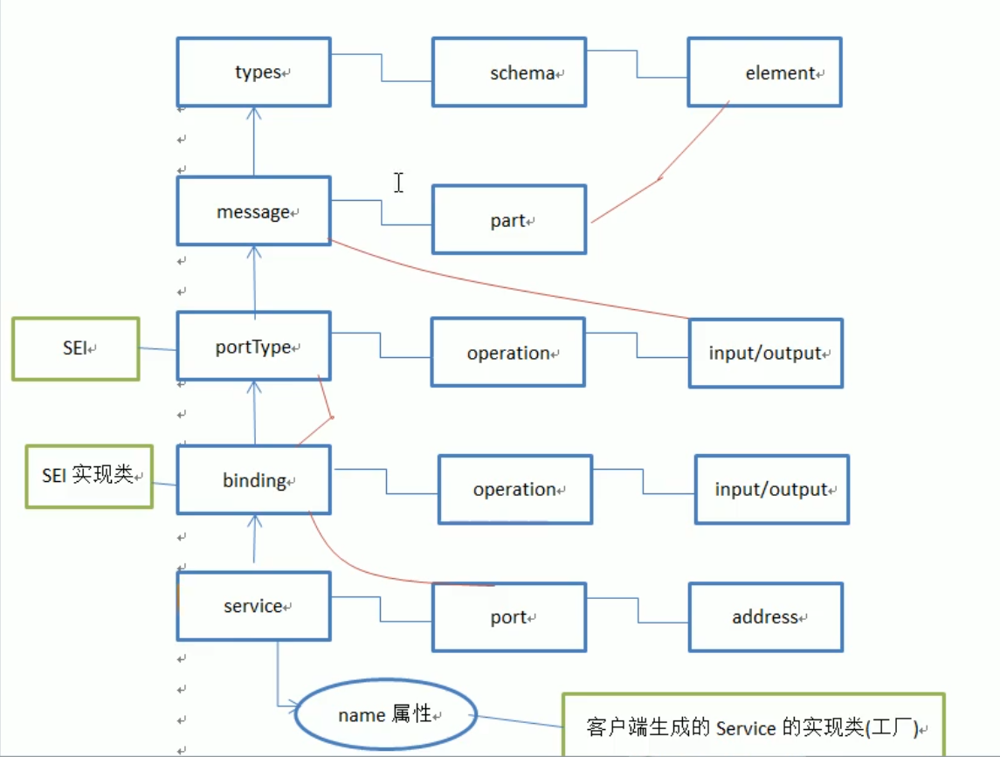

# WebService

## 1. 概念

1. WebService是两个系统的远程调用，是两个系统进行数据交互，如应用：天气预报服务、银行ATM取款、使用邮箱账号登录个网站。
2. WebService之间的调用是可以跨语言调用的。Java、.Net、php等，发送Http请求，使用的数据格式是XML格式。
3. 一个免费的WebService服务网站：http://www.webxml.com.cn/zh_cn/index.aspx

## 2. 专业名词

1. SOAP：Simple Object Access Protocol(简单对象访问协议)

   ​	SOAP= HTTP + XML

   ```html
   SOAP的组成：
   	Envelope：必须部分，以XML的根元素出现
   	Headers: 可选的
   	Body：必须的。在body部分，包含要执行的服务器的方法，和发送到服务器的数据。
   ```

2. WSDL：Webservice description language (webservice 的服务描述语言)

   ​	通过XML形式说明服务在什么地方——地址

   ​	通过XML形式说明服务提供什么样的方法——如何调用

3. XML：用于传输格式化的数据，是Web服务的基础

   - namespace——命名空间
     - xmlns ="http://test.cn" 使用默认的命名空间。
     - xmlns:test ="http://test.cn" 使用指定名称的命名空间

## 3. wsdl文档结构




```xml
<!--tns: 表示引用-->

<wsdl:definitions targetNamespace="http://WebXml.com.cn/">
    <wsdl:documentation>
        <a href="http://www.webxml.com.cn/" target="_blank">WebXml.com.cn</a> <strong>国内手机号码归属地查询WEB服务</strong>，提供最新的国内手机号码段归属地数据，每月更新。<br />使用本站 WEB 服务请注明或链接本站：<a href="http://www.webxml.com.cn/" target="_blank">http://www.webxml.com.cn/</a> 感谢大家的支持！<br />&nbsp;
    </wsdl:documentation>
    <wsdl:types>
        <s:schema elementFormDefault="qualified" targetNamespace="http://WebXml.com.cn/">
        </s:schema>
    </wsdl:types>
   <!--
   message: 定义消息的结构
   part：指定引用types 中定义的标签片段
   -->
    <wsdl:message name="getMobileCodeInfoSoapIn">
        <wsdl:part name="parameters" element="tns:getMobileCodeInfo"/>
    </wsdl:message>
    <wsdl:message name="getMobileCodeInfoSoapOut">
        <wsdl:part name="parameters" element="tns:getMobileCodeInfoResponse"/>
    </wsdl:message>
    <wsdl:message name="getDatabaseInfoSoapIn">
        <wsdl:part name="parameters" element="tns:getDatabaseInfo"/>
    </wsdl:message>
    <wsdl:message name="getDatabaseInfoSoapOut">
        <wsdl:part name="parameters" element="tns:getDatabaseInfoResponse"/>
    </wsdl:message>
    <wsdl:message name="getMobileCodeInfoHttpGetIn">
        <wsdl:part name="mobileCode" type="s:string"/>
        <wsdl:part name="userID" type="s:string"/>
    </wsdl:message>
    <wsdl:message name="getMobileCodeInfoHttpGetOut">
        <wsdl:part name="Body" element="tns:string"/>
    </wsdl:message>
    <wsdl:message name="getDatabaseInfoHttpGetIn"/>
    <wsdl:message name="getDatabaseInfoHttpGetOut">
        <wsdl:part name="Body" element="tns:ArrayOfString"/>
    </wsdl:message>
    <wsdl:message name="getMobileCodeInfoHttpPostIn">
        <wsdl:part name="mobileCode" type="s:string"/>
        <wsdl:part name="userID" type="s:string"/>
    </wsdl:message>
    <wsdl:message name="getMobileCodeInfoHttpPostOut">
        <wsdl:part name="Body" element="tns:string"/>
    </wsdl:message>
    <wsdl:message name="getDatabaseInfoHttpPostIn"/>
    <wsdl:message name="getDatabaseInfoHttpPostOut">
        <wsdl:part name="Body" element="tns:ArrayOfString"/>
    </wsdl:message>

    <!--
        portType: 用来定义服务器端的SEI
            operation: 用来指定SEI中的处理请求的方法
                input: 指定客户端应用传过去的数据， 引用message标签所定义的参数
                output: 指定服务端返回的数据，引用message标签所定义的参数
    -->
    <wsdl:portType name="MobileCodeWSSoap">
        <wsdl:operation name="getMobileCodeInfo">
            <wsdl:documentation>
                <br /><h3>获得国内手机号码归属地省份、地区和手机卡类型信息</h3><p>输入参数：mobileCode = 字符串（手机号码，最少前7位数字），userID = 字符串（商业用户ID） 免费用户为空字符串；返回数据：字符串（手机号码：省份 城市 手机卡类型）。</p><br />
            </wsdl:documentation>
            <wsdl:input message="tns:getMobileCodeInfoSoapIn"/>
            <wsdl:output message="tns:getMobileCodeInfoSoapOut"/>
        </wsdl:operation>
        <wsdl:operation name="getDatabaseInfo">
            <wsdl:documentation>
                <br /><h3>获得国内手机号码归属地数据库信息</h3><p>输入参数：无；返回数据：一维字符串数组（省份 城市 记录数量）。</p><br />
            </wsdl:documentation>
            <wsdl:input message="tns:getDatabaseInfoSoapIn"/>
            <wsdl:output message="tns:getDatabaseInfoSoapOut"/>
        </wsdl:operation>
    </wsdl:portType>
    <wsdl:portType name="MobileCodeWSHttpGet">
        <wsdl:operation name="getMobileCodeInfo">
            <wsdl:documentation>
                <br /><h3>获得国内手机号码归属地省份、地区和手机卡类型信息</h3><p>输入参数：mobileCode = 字符串（手机号码，最少前7位数字），userID = 字符串（商业用户ID） 免费用户为空字符串；返回数据：字符串（手机号码：省份 城市 手机卡类型）。</p><br />
            </wsdl:documentation>
            <wsdl:input message="tns:getMobileCodeInfoHttpGetIn"/>
            <wsdl:output message="tns:getMobileCodeInfoHttpGetOut"/>
        </wsdl:operation>
        <wsdl:operation name="getDatabaseInfo">
            <wsdl:documentation>
                <br /><h3>获得国内手机号码归属地数据库信息</h3><p>输入参数：无；返回数据：一维字符串数组（省份 城市 记录数量）。</p><br />
            </wsdl:documentation>
            <wsdl:input message="tns:getDatabaseInfoHttpGetIn"/>
            <wsdl:output message="tns:getDatabaseInfoHttpGetOut"/>
        </wsdl:operation>
    </wsdl:portType>
    <wsdl:portType name="MobileCodeWSHttpPost">
        <wsdl:operation name="getMobileCodeInfo">
            <wsdl:documentation>
                <br /><h3>获得国内手机号码归属地省份、地区和手机卡类型信息</h3><p>输入参数：mobileCode = 字符串（手机号码，最少前7位数字），userID = 字符串（商业用户ID） 免费用户为空字符串；返回数据：字符串（手机号码：省份 城市 手机卡类型）。</p><br />
            </wsdl:documentation>
            <wsdl:input message="tns:getMobileCodeInfoHttpPostIn"/>
            <wsdl:output message="tns:getMobileCodeInfoHttpPostOut"/>
        </wsdl:operation>
        <wsdl:operation name="getDatabaseInfo">
            <wsdl:documentation>
                <br /><h3>获得国内手机号码归属地数据库信息</h3><p>输入参数：无；返回数据：一维字符串数组（省份 城市 记录数量）。</p><br />
            </wsdl:documentation>
            <wsdl:input message="tns:getDatabaseInfoHttpPostIn"/>
            <wsdl:output message="tns:getDatabaseInfoHttpPostOut"/>
        </wsdl:operation>
    </wsdl:portType>

    <!--
        binding: 用于定义SEI的实现类
            type属性：引用上面的<portType>
            <soap:binding style="document" transport="http://schemas.xmlsoap.org/soap/http"/> ：绑定的数据是一个document（xml）
            operation: 用来定义实现的方法
                <soap:operation soapAction="http://WebXml.com.cn/getMobileCodeInfo" style="document"/> ：传输的是document（xml)
                input: 指定客户端应用传过去的数据
                    <soap:body use="literal"/>: 文本数据
                output: 指定服务端返回的数据
                    <soap:body use="literal"/>: 文本数据
    -->
    <wsdl:binding name="MobileCodeWSSoap" type="tns:MobileCodeWSSoap">
        <soap:binding transport="http://schemas.xmlsoap.org/soap/http"/>
        <wsdl:operation name="getMobileCodeInfo">
            <soap:operation soapAction="http://WebXml.com.cn/getMobileCodeInfo" style="document"/>
            <wsdl:input>
                <soap:body use="literal"/>
            </wsdl:input>
            <wsdl:output>
                <soap:body use="literal"/>
            </wsdl:output>
        </wsdl:operation>
        <wsdl:operation name="getDatabaseInfo">
            <soap:operation soapAction="http://WebXml.com.cn/getDatabaseInfo" style="document"/>
            <wsdl:input>
                <soap:body use="literal"/>
            </wsdl:input>
            <wsdl:output>
                <soap:body use="literal"/>
            </wsdl:output>
        </wsdl:operation>
    </wsdl:binding>
    <wsdl:binding name="MobileCodeWSSoap12" type="tns:MobileCodeWSSoap">
        <soap12:binding transport="http://schemas.xmlsoap.org/soap/http"/>
        <wsdl:operation name="getMobileCodeInfo">
            <soap12:operation soapAction="http://WebXml.com.cn/getMobileCodeInfo" style="document"/>
            <wsdl:input>
                <soap12:body use="literal"/>
            </wsdl:input>
            <wsdl:output>
                <soap12:body use="literal"/>
            </wsdl:output>
        </wsdl:operation>
        <wsdl:operation name="getDatabaseInfo">
            <soap12:operation soapAction="http://WebXml.com.cn/getDatabaseInfo" style="document"/>
            <wsdl:input>
                <soap12:body use="literal"/>
            </wsdl:input>
            <wsdl:output>
                <soap12:body use="literal"/>
            </wsdl:output>
        </wsdl:operation>
    </wsdl:binding>
    <wsdl:binding name="MobileCodeWSHttpGet" type="tns:MobileCodeWSHttpGet">
        <http:binding verb="GET"/>
        <wsdl:operation name="getMobileCodeInfo">
            <http:operation location="/getMobileCodeInfo"/>
            <wsdl:input>
                <http:urlEncoded/>
            </wsdl:input>
            <wsdl:output>
                <mime:mimeXml part="Body"/>
            </wsdl:output>
        </wsdl:operation>
        <wsdl:operation name="getDatabaseInfo">
            <http:operation location="/getDatabaseInfo"/>
            <wsdl:input>
                <http:urlEncoded/>
            </wsdl:input>
            <wsdl:output>
                <mime:mimeXml part="Body"/>
            </wsdl:output>
        </wsdl:operation>
    </wsdl:binding>
    <wsdl:binding name="MobileCodeWSHttpPost" type="tns:MobileCodeWSHttpPost">
        <http:binding verb="POST"/>
        <wsdl:operation name="getMobileCodeInfo">
            <http:operation location="/getMobileCodeInfo"/>
            <wsdl:input>
                <mime:content type="application/x-www-form-urlencoded"/>
            </wsdl:input>
            <wsdl:output>
                <mime:mimeXml part="Body"/>
            </wsdl:output>
        </wsdl:operation>
        <wsdl:operation name="getDatabaseInfo">
        </wsdl:operation>
    </wsdl:binding>
    <!--
    service： 服务器端的一个webservice的容器
        name: 用于指定客户端容器类
        port: 用来制定一个服务器端处理请求的入口
            binding：引用上面定义的<binding>
            address: 当前webservice 的请求地址
    -->
    <wsdl:service name="MobileCodeWS">
      <!--  <wsdl:port binding="tns:dataServiceSoapBinding" name="dataServicePort">
            <soap:address location="http://172.20.2.112:8888/lfserv/services/data"/>
        </wsdl:port>-->
    </wsdl:service>
</wsdl:definitions>
```

## 4. 基本使用

### 4.1 如何发布webService

```java
/*
1.定义SEI
@WebService
@WebMethod
*/
@WebService
public class UserDao {

    public void add(){
        System.out.println("add");
    }
    public void update(){
        System.out.println("update");
    }

    /**
     * webMethod -> exclude=true 为不发布该接口
     */
    @WebMethod(exclude = true)
    public void sayHello(){
        System.out.println("hello");
    }
}
/**
 * 2.发布SEI
 * 		1. 发布的地址
 * 		2. 被发布的是哪一个
 *  	发布这个webservice的时候，wsdl也一并发布出来了，用来描述该服务如何调用
 */

  Endpoint.publish("http://localhost:8989/userDao",new UserDao());
```

### 4.2 如何请求webService

#### **1. 生成客户端调用方式** 

 **注意：该种方式使用简单，但一些关键的元素在代码生成时写死到生成代码中，不方便维护，所以仅用于测试。** 
 （1）Wsimport命令介绍 

   - Wsimport就是jdk（1.6版本之后）提供的的一个工具，他的作用就是根据WSDL地址生成客户端代码；
   -  Wsimport位置JAVA_HOME/bin 
 			- Wsimport常用的参数： 

    	-s，生成java文件的 
    	-d，生成class文件的，默认的参数 
        	-p，指定包名的，如果不加该参数，默认包名就是wsdl文档中的命名空间的倒序； 
   - **Wsimport仅支持SOAP1.1客户端的生成；**

（2）调用公网手机号归属地查询服务

 第一步：wsimport生成客户端代码 

```java
wsimport -p cn.itcast.mobile -s . http://ws.webxml.com.cn/WebServices/MobileCodeWS.asmx?wsdl 
```


 第二步：阅读使用说明书（wsdl文档），使用生成的客户端代码调用服务端

```java
package cn.itcast.mobile.client;

import cn.itcast.mobile.MobileCodeWS;
import cn.itcast.mobile.MobileCodeWSSoap;
/**
 * 
* @ClassName: MobileClient 
* @Description: TODO(公网手机号查询客户端) 
* @author 
* @date 2017年11月8日 上午8:35:02 
*
 */
public class MobileClient {
    public static void main(String[] args) {
        //创建服务访问点集合的对象，例如：<wsdl:service name="MobileCodeWS">
        MobileCodeWS mobileCodeWS = new MobileCodeWS();
        //获取服务实现类，例如：<wsdl:portType name="MobileCodeWSSoap">，port--binding--portType
        //MobileCodeWSSoap mobileCodeWSSoap = mobileCodeWS.getPort( MobileCodeWSSoap.class );
        //根据服务访问点的集合中的服务访问点的绑定对象来获得绑定的服务类
        //获得服务类的方式是get+服务访问点的name：getWSServerPort
        MobileCodeWSSoap mobileCodeWSSoap = mobileCodeWS.getMobileCodeWSSoap();
        String mobileCodeInfo = mobileCodeWSSoap.getMobileCodeInfo("18518114962", "");
        System.out.println(mobileCodeInfo);
    }
}

// 我自己的 demo
public static void main(String[] args) {
    UserDaoService userDaoService = new UserDaoService();
    UserDao userDaoPort = userDaoService.getUserDaoPort();
    User userById = userDaoPort.getUserById(1);
    System.out.println(userById.getName());
}
```

#### **2. service编程调用方式** 

 注意： 
 （1）该种方式可以自定义关键元素，方便以后维护，是一种标准的开发方式； 
 （2）这种方式同样需要wsimport生成客户端代码,只不过仅需要将服务接口类引入即可，例如如果需要`<wsdl:port name="MobileCodeWSSoap" binding="tns:MobileCodeWSSoap">`端口服务，则需要将生成的MobileCodeWSSoap.class类引入；

```java
package cn.itcast.mobile.client;  

import java.io.IOException;
import java.net.URL;

import javax.xml.namespace.QName;
import javax.xml.ws.Service;

import cn.itcast.mobile.MobileCodeWSSoap;  

/** 
 *  
 *  Title: ServiceClient.java
 *  Description:Service编程实现服务端调用
 *  这种方式同样需要wsimport生成客户端代码,只不过仅需要将服务接口类引入即可，例如如果需要
 *  <wsdl:port name="MobileCodeWSSoap" binding="tns:MobileCodeWSSoap">
 *  端口服务，则需要将生成的MobileCodeWSSoap.class类引入
 */  
public class ServiceClient {  

    public static void main(String[] args) throws IOException {  
        //创建WSDL的URL，注意不是服务地址  
        URL url = new URL("http://ws.webxml.com.cn/WebServices/MobileCodeWS.asmx?wsdl");  

        //创建服务名称  
        //1.namespaceURI - 命名空间地址 (wsdl文档中的targetNamespace)
        //2.localPart - 服务视图名  (wsdl文档中服务名称，例如<wsdl:service name="MobileCodeWS">)
        QName qname = new QName("http://WebXml.com.cn/", "MobileCodeWS");  

        //创建服务视图  
        //参数解释：  
        //1.wsdlDocumentLocation - wsdl地址  
        //2.serviceName - 服务名称  
        Service service = Service.create(url, qname);  
        //获取服务实现类 
        //参数解释:serviceEndpointInterface - 服务端口(wsdl文档中服务端口的name属性，例如<wsdl:port name="MobileCodeWSSoap" binding="tns:MobileCodeWSSoap">)
        MobileCodeWSSoap mobileCodeWSSoap = service.getPort(MobileCodeWSSoap.class);  
        //调用查询方法  
        String result = mobileCodeWSSoap.getMobileCodeInfo("1866666666", "");  
        System.out.println(result);  
    }  
} 
```

#### **3. HttpURLConnection调用方式**

开发步骤： 
 第一步：创建服务地址 
 第二步：打开一个通向服务地址的连接 
 第三步：设置参数 
 设置POST，POST必须大写，如果不大写，报如下异常 
  
 如果不设置输入输出，会报如下异常 
  
 第四步：组织SOAP数据，发送请求 
 第五步：接收服务端响应，打印

```java
package cn.itcast.mobile.client;

import java.io.BufferedReader;
import java.io.IOException;
import java.io.InputStream;
import java.io.InputStreamReader;
import java.io.OutputStream;
import java.net.HttpURLConnection;
import java.net.URL;

/**
 * 
* @ClassName: HttpURLConectionMode 
* @Description: TODO(通过HttpURLConnection发送http请求) 
*   sope协议，比较麻烦的是需要拼接xml格式的请求数据
* @author
* @date 2017年11月8日 上午9:18:24 
*
 */
public class HttpURLConectionMode {
    public static void main(String[] args) throws IOException {
        //第一步：创建服务地址，不是WSDL地址 
        URL url = new URL("http://ws.webxml.com.cn/WebServices/MobileCodeWS.asmx");  
        //第二步：打开一个通向服务地址的连接  
        HttpURLConnection connection = (HttpURLConnection) url.openConnection();  
        //第三步：设置参数  
        //3.1发送方式设置：POST必须大写  
        connection.setRequestMethod("POST");
        //3.2设置数据格式：content-type  
        connection.setRequestProperty("content-type", "text/xml;charset=utf-8");  
        //3.3设置输入输出，因为默认新创建的connection没有读写权限，  
        connection.setDoInput(true);  
        connection.setDoOutput(true);

        //第四步：组织SOAP数据，发送请求  
        String soapXML = getXML("15226466316");
        OutputStream os = connection.getOutputStream();  
        os.write(soapXML.getBytes()); 

        //第五步：接收服务端响应，打印（xml格式数据）
        int responseCode = connection.getResponseCode();  
        if(200 == responseCode){//表示服务端响应成功
            InputStream is = null;
            InputStreamReader isr = null;
            BufferedReader br = null;
            StringBuilder sb = null;
            try {
                is = connection.getInputStream();  
                isr = new InputStreamReader(is);  
                br = new BufferedReader(isr);  

                sb = new StringBuilder();  
                String temp = null;  
                while(null != (temp = br.readLine())){  
                    sb.append(temp);  
                }
                 System.out.println(sb.toString()); 
            } catch (Exception e) {
                e.printStackTrace();
                throw e;
            } finally {
                br.close();
                isr.close();
                is.close();
            }
        }  

        os.close();
    }

    /** 
     *  <?xml version="1.0" encoding="utf-8"?> 
        <soap:Envelope xmlns:xsi="http://www.w3.org/2001/XMLSchema-instance" xmlns:xsd="http://www.w3.org/2001/XMLSchema" xmlns:soap="http://schemas.xmlsoap.org/soap/envelope/"> 
          <soap:Body> 
            <getMobileCodeInfo xmlns="http://WebXml.com.cn/"> 
              <mobileCode>string</mobileCode> 
              <userID>string</userID> 
            </getMobileCodeInfo> 
          </soap:Body> 
        </soap:Envelope> 
     * @param phoneNum 
     * @return 
     */  
    public static String getXML(String phoneNum){  
        String soapXML = "<?xml version=\"1.0\" encoding=\"utf-8\"?>"  
        +"<soap:Envelope xmlns:xsi=\"http://www.w3.org/2001/XMLSchema-instance\" xmlns:xsd=\"http://www.w3.org/2001/XMLSchema\" xmlns:soap=\"http://schemas.xmlsoap.org/soap/envelope/\">"  
            +"<soap:Body>"  
            +"<getMobileCodeInfo xmlns=\"http://WebXml.com.cn/\">"  
                +"<mobileCode>"+phoneNum+"</mobileCode>"  
              +"<userID></userID>"  
            +"</getMobileCodeInfo>"  
          +"</soap:Body>"  
        +"</soap:Envelope>";  
        return soapXML;  
    }  

}
```

#### **4. Ajax调用方式（存在跨域问题）** 

 跨域解决参考：http://www.cnblogs.com/zhangzt/p/5966185.html 
 jsonp无法实现跨域，因为webservice服务的响应格式为xml格式；

```html
<!doctype html>  
<html lang="en">  
 <head>  
  <meta charset="UTF-8">  
  <title>Document</title>  
  <script type="text/javascript">  
    function queryMobile(){  
        //创建XMLHttpRequest对象  
        var xhr = new XMLHttpRequest();  
        //打开连接  
        xhr.open("post","http://webservice.webxml.com.cn/WebServices/MobileCodeWS.asmx",true);  
        //设置数据类型  
        xhr.setRequestHeader("content-type","text/xml;charset=utf-8");  
        //设置回调函数  
        xhr.onreadystatechange=function(){  
            //判断是否发送成功和判断服务端是否响应成功  
            if(4 == xhr.readyState && 200 == xhr.status){  
                alert(xhr.responseText);  
            }  
        }  
        //组织SOAP协议数据  
        var soapXML = "<?xml version=\"1.0\" encoding=\"utf-8\"?>"  
        +"<soap:Envelope xmlns:xsi=\"http://www.w3.org/2001/XMLSchema-instance\" xmlns:xsd=\"http://www.w3.org/2001/XMLSchema\" xmlns:soap=\"http://schemas.xmlsoap.org/soap/envelope/\">"  
            +"<soap:Body>"  
            +"<getMobileCodeInfo xmlns=\"http://WebXml.com.cn/\">"  
                +"<mobileCode>"+document.getElementById("phoneNum").value+"</mobileCode>"  
              +"<userID></userID>"  
            +"</getMobileCodeInfo>"  
          +"</soap:Body>"  
        +"</soap:Envelope>";  
        alert(soapXML);  
        //发送数据  
        xhr.send(soapXML);  
    }  
  </script>  
 </head>  
 <body>  
  手机号查询：<input type="text" id="phoneNum"/> <input type="button" value="查询" onclick="javascript:queryMobile();"/>  
 </body>  
</html> 
```

## 5 CXF

> Apache CXF 是一个开源的 WebService 框架，CXF可以用来构建和开发  WebService，这些服务可以支持多种协议，比如：SOAP、POST/HTTP、HTTP ，CXF  大大简化了WebService并且可以天然地和 Spring 进行无缝集成。CXF是 Celtrix （ESB框架）和  XFire（webserivice） 合并而成，核心是org.apache.cxf.Bus(总线)，类似于Spring的  ApplicationContext，CXF默认是依赖于Spring的，另 CXF 发行包中的jar，如果全部放到lib中，需要 JDK1.6  及以上，否则会报JAX-WS版本不一致的问题。CXF 内置了Jetty服务器 ，它是servlet容器。

### 5.1 依赖maven坐标

```java
// 服务器jar包
<dependency>
    <groupId>org.apache.cxf</groupId>
    <artifactId>cxf-rt-transports-http</artifactId>
    <version>3.3.5</version>
</dependency>
<dependency>
    <groupId>org.apache.cxf</groupId>
    <artifactId>cxf-core</artifactId>
    <version>3.3.5</version>
</dependency>
<dependency>
    <groupId>org.apache.cxf</groupId>
    <artifactId>cxf-rt-transports-http-jetty</artifactId>
    <version>3.3.5</version>
</dependency>
// 客户端jar 包 ,同时需要 上面的http 包
<dependency>
    <groupId>org.apache.cxf</groupId>
    <artifactId>cxf-rt-frontend-jaxws</artifactId>
    <version>3.3.5</version>
</dependency>
```

### 5.2 CXF拦截器

```java
// 1. 服务端拦截器
Endpoint endpoint = Endpoint.publish("http://localhost:8989/userDao", new UserDao());

EndpointImpl endpointImpl = (EndpointImpl)endpoint;
// 服务端的日志入拦截器
List<Interceptor<? extends Message>> inInterceptors = endpointImpl.getInInterceptors();
inInterceptors.add(new LoggingInInterceptor());
// 服务端的日志出拦截器
List<Interceptor<? extends Message>> outInterceptors = endpointImpl.getOutInterceptors();
outInterceptors.add(new LoggingOutInterceptor());
System.out.println("web service发布成功");

// 2. 客户端拦截器
UserDaoService userDaoService = new UserDaoService();
UserDao userDaoPort = userDaoService.getUserDaoPort();
// 发送请求的客户端对象
Client client = ClientProxy.getClient(userDaoPort);
// 客户端的日志出拦截器
List<Interceptor<? extends Message>> outInterceptors = client.getOutInterceptors();
outInterceptors.add(new LoggingOutInterceptor());
// 客户端的日志入拦截器
List<Interceptor<? extends Message>> inInterceptors = client.getInInterceptors();
inInterceptors.add(new LoggingOutInterceptor());
User userById = userDaoPort.getUserById(1);
System.out.println(userById.getName());
```

### 5.3 自定义拦截器

1. 服务端拦截器

   ```java
   /**
    * 拦截器类
    */
   public class CheckUserInterceptor extends AbstractPhaseInterceptor<SoapMessage> {
   
       /**
        * 确定什么时候拦截
        */
       public CheckUserInterceptor() {
           super(Phase.PRE_PROTOCOL); // 准备协议化时拦截
       }
       
       @Override
       public void handleMessage(SoapMessage soapMessage) throws Fault {
           Header header = soapMessage.getHeader(new QName("youxiue"));
           if(header!=null){
               Element element = (Element) header.getObject();
               String name = element.getElementsByTagName("name").item(0).getTextContent();
               String password = element.getElementsByTagName("password").item(0).getTextContent();
               if("xfb".equals(name)&& "123456".equals(password)){
                   System.out.println("通过拦截器");
               }else{
                   System.out.printf("用户名:%s, 密码:%s",name,password);
                   throw new RuntimeException("用户名或密码错误");
               }
           }
       }
   }
   
   /**
    * 拦截器的使用
    */
   inInterceptors.add(new CheckUserInterceptor());
   ```

   

2. 客户端拦截器

   ```java
   /**
    *
    */
   public class AddUserInterceptor extends AbstractPhaseInterceptor<SoapMessage> {
   
       private String name;
       private String password;
   
       /**
        * 确定什么时候拦截
        */
       public AddUserInterceptor(String name, String password) {
           super(Phase.PRE_PROTOCOL); // 准备协议化时拦截
           this.name = name;
           this.password = password;
       }
   
       /**
        * <Envelope>
        *     <!--头标签, 携带我们的身份信息 也就是我们拦截器要添加的信息-->
        *     <head>
        *         <youxiue>
        *             <name>xfb</name>
        *             <password>123456</password>
        *         </youxiue>
        *     </head>
        *
        *     <!--消息内容 -->
        *     <body>
        *         <sayHello>
        *             <arg0>BOB</arg0>
        *         </sayHello>
        *     </body>
        * </Envelope>
        * @param soapMessage
        * @throws Fault
        */
   
       public void handleMessage(SoapMessage soapMessage) throws Fault {
           List<Header> headers = soapMessage.getHeaders();
   		// 这里应该是DOMHelper.createDocument();  没找到DOMHelper的坐标
           Document document = DocumentHelper.createDocument();
           Element rootEle = document.addElement("youxiue");
           Element nameElement = document.addElement("name");
           nameElement.setText(name);
           rootEle.appendAttributes(nameElement);
           Element passEle = document.addElement("password");
           passEle.setText(password);
           rootEle.appendAttributes(passEle);
   
           headers.add(new Header(new QName("youxiue"),rootEle));
       }
   }
   ```

   